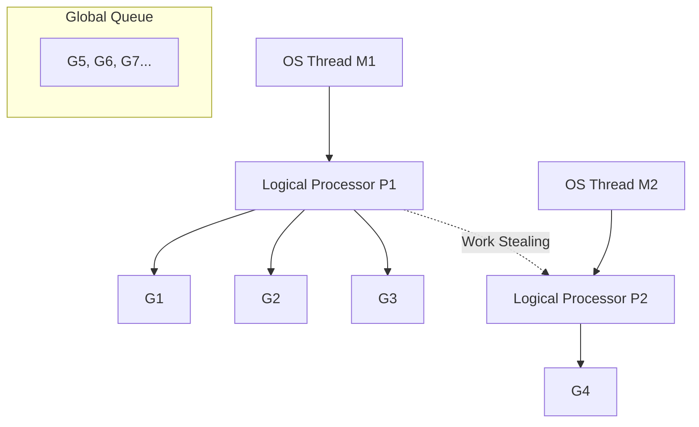
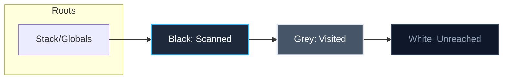

# Chapter 22: Advanced Go Mastery and Runtime Internals

## Purpose

To transition from writing working Go code to possessing an absolute mastery of the Go runtime, compiler, and internal systems. As the PEACE SME Grant Portal backend scales, simple language features become complex runtime decisions. Understanding scheduler states, memory layouts, garbage collection sweeps, and profiling outputs is what separates an intermediate developer from a Go systems engineer.

---

## Concept Map of Advanced Topics

| Concept | Portal Application | Performance/Resource Impact |
|---|---|---|
| [GMP Scheduler](term:gmp) | Managing concurrent HTTP requests and [goroutine](term:goroutine) queues | CPU utilization and context-switch latency |
| [Escape Analysis](term:escape-analysis) | Deciding where variables live (stack vs heap) | Allocation overhead and GC pressure |
| [Garbage Collection](term:garbage-collection) | Clearing stale report memory and cache buffers | Latency spikes (STW pauses) and memory leaks |
| [Interface Internals](term:interface) | Dynamically dispatching database mock services | Virtual method table lookup overhead |
| [Reflection](term:reflection) | JSON encoding/decoding of custom fields | CPU bounds during serialization |
| [Generics](term:generics) | Generic Redis client caches or transactional repositories | Compile-time complexity vs runtime efficiency |
| [Memory Alignment](term:memory-alignment) | Packing database structs like `User` or `Grant` | Size of arrays, caching performance, and memory size |
| [Profiling](term:profiling) | Finding bottlenecks in HFC fraud-scoring algorithms | CPU cycle conservation and memory bounds |
| [Unsafe Operations](term:unsafe) | Direct memory access and fast type conversion | Type safety bypass, potential panics, and security risks |
| [CGO](term:cgo) & [WebAssembly](term:wasm) | Executing legacy C decoders or in-browser fraud predictions | Process overhead and memory isolation boundaries |

---

## Part 1: Go Runtime Internals — The GMP Scheduler

Go's concurrency is powered by its runtime scheduler, known as the **GMP Model**. Understanding how this scheduler works is critical for diagnosing latency spikes or thread exhaustion on your PEACE SME server.

### The Components: G, M, and P

- **G (Goroutine)**: Represents the [goroutine](term:goroutine) stack, execution state, and PC (program counter). It is a user-space thread starting at 2KB memory size.
- **M (Machine / OS Thread)**: Represents an actual operating system thread managed by the OS scheduler.
- **P (Processor)**: Represents a logical processor or execution resource. P manages a local run queue of Gs. The number of Ps defaults to the CPU core count (`GOMAXPROCS`).



### Work Stealing and Hand-off

The scheduler utilizes two primary mechanisms to balance workload across OS threads:

1. **Work Stealing**: When a logical processor `P` runs out of goroutines in its local queue, it attempts to steal half of the goroutines from another `P`'s local queue. If those are empty, it checks the global run queue.
2. **Syscall Hand-off**: When a goroutine `G` executes a blocking system call (e.g., reading a file or waiting on a slow database query in the `GrantRepository`), the OS thread `M` blocks. The scheduler detaches the logical processor `P` from `M` and assigns it to a new or idle OS thread `M2`, allowing the remaining goroutines in `P`'s queue to continue executing.

### Cooperative vs. Non-Cooperative Preemption

Historically, Go used cooperative preemption: a goroutine could only be preempted if it called a function (which triggered a stack-guard check). If a goroutine ran an infinite loop containing no function calls, it could hog the thread forever.

In Go 1.14+, the runtime introduced **asynchronous non-cooperative preemption**. The scheduler now uses OS signals (`SIGURG` on Unix/Linux) to interrupt long-running goroutines at arbitrary points. This ensures that a single misbehaved HFC fraud scoring loop cannot lock up your web server.

:::expandable [Term: Preemption]
Preemption is the act of temporarily interrupting a task being carried out by a computer system, without requiring its cooperation, and with the intention of resuming the task at a later time.
:::

---

## Part 2: Go Memory Management — Stack vs. Heap

To optimize the throughput of the PEACE SME backend, you must understand how Go allocates memory. Go categorizes memory allocations into the **Stack** and the **Heap**.

### Stack Allocation

Each [goroutine](term:goroutine) is allocated its own stack. Stack allocation is incredibly fast (a simple increment of the stack pointer) and self-cleaning. When a function returns, its stack frame is popped, and memory is reclaimed instantly with zero overhead.

### Heap Allocation

The heap is a shared memory space. Variables allocated on the heap must be tracked, and their memory is reclaimed by the [Garbage Collector](term:garbage-collection). Heap allocation requires runtime synchronization and causes CPU overhead.

### Escape Analysis

The Go compiler performs [Escape Analysis](term:escape-analysis) during compilation to determine whether a variable can be safely allocated on the stack or must "escape" to the heap.

A variable escapes to the heap if:
1. It is returned as a pointer from a function.
2. It is assigned to a global variable.
3. It is passed into an interface parameter (e.g., `fmt.Println(x)`).
4. Its size is too large or dynamic (e.g., a slice created with a dynamic length variable).

Let's examine this in code:

```go
package main

type Applicant struct {
    ID   int64
    Name string
}

// Escapes: returning a pointer to local variable
func NewApplicant(name string) *Applicant {
    a := Applicant{ID: 101, Name: name}
    return &a // a escapes to the heap because its pointer is accessed out-of-scope
}

// Does not escape: passed by value, stack allocated
func ProcessApplicant(a Applicant) int64 {
    return a.ID
}
```

To view escape analysis decisions, compile your project with optimization flags:

```bash
go build -gcflags="-m" ./cmd/server
```

Output details:
```text
./main.go:9:9: &a escapes to heap
./main.go:8:2: moved to heap: a
```

> [!TIP]
> To minimize memory allocation and GC overhead in hot paths (like parsing JWT tokens or executing middleware), avoid returning pointers for small structs. Pass by value instead.

---

## Part 3: Garbage Collection Internals and Tuning

Go uses a concurrent, tri-color mark-and-sweep [Garbage Collector](term:garbage-collection). It runs alongside your application code, attempting to minimize "Stop The World" (STW) pauses.

### The Tri-Color Mark-and-Sweep Algorithm

The GC colors memory blocks using three colors:

1. **White**: Candidate objects for garbage collection (unreachable).
2. **Grey**: Reachable objects, but their referenced objects have not yet been scanned.
3. **Black**: Reachable objects, and their referenced objects have been scanned.



1. **Mark Phase**: The GC starts from "roots" (stack pointers, global variables) and colors them grey. It then traverses references, coloring referenced objects grey and marking scanned objects black. This happens concurrently with your application using a **write barrier** to detect memory writes during scanning.
2. **Sweep Phase**: Once the mark phase is done, all remaining white objects are reclaimed concurrently.

### Tuning the GC: GOGC and GOMEMLIMIT

Go provides two environment variables to control GC behavior:

- `GOGC`: Controls the GC target percentage. By default, `GOGC=100`, which means the GC will trigger when the heap size doubles compared to the live heap size after the previous GC. Setting `GOGC=200` delays GC triggers (saving CPU cycles but using more RAM).
- `GOMEMLIMIT`: Introduced in Go 1.19. It defines a soft memory limit (e.g., `GOMEMLIMIT=1GiB`). If memory usage approaches this limit, the GC will trigger more aggressively to prevent Out-Of-Memory (OOM) process crashes, ignoring `GOGC` targets if necessary.

```bash
# Example command to run your server in Docker with optimized memory parameters
GOGC=100 GOMEMLIMIT=1500MiB ./server
```

---

## Part 4: Interface Internals — `iface` and `eface`

Go's [interfaces](term:interface) are satisfyingly implicit, but they are not free. At runtime, interfaces are represented by two-word data structures.

### The Internal Structures

1. **`iface`**: Used for interfaces that define methods.
   - It contains a pointer to an **Itab** (interface table), which holds the dynamic type metadata and a list of function pointers (virtual table).
   - It contains a pointer to the actual dynamic **data** value.

2. **`eface`**: Used for empty interfaces (`interface{}` or `any`).
   - It contains a pointer to the **Type** descriptor (metadata about the dynamic type).
   - It contains a pointer to the actual dynamic **data** value.

```go
// Structure representation of an interface
type iface struct {
    tab  *itab          // Pointer to Interface Table
    data unsafe.Pointer // Pointer to actual data value
}
```

### Performance Implications

- **Memory Allocation**: Assigning a concrete value to an interface variable causes the value to escape to the heap (unless the compiler can prove it doesn't escape).
- **Dynamic Dispatch**: Calling a method on an interface requires traversing the `itab` function pointer array. This disables compiler inlining and adds a small CPU overhead.

> [!NOTE]
> Do not use interfaces everywhere. Use interfaces when you need to swap implementations (e.g., swapping a real email sender with a mockup in tests). If there is only one implementation, accept concrete types.

---

## Part 5: Reflection (`reflect`) & Struct Tags in JSON Serialization

Reflection is the ability of a program to examine its own variables, types, and values at runtime. In Go, reflection is implemented in the `reflect` package.

### The Laws of Reflection

1. Reflection goes from interface value to reflection object.
2. Reflection goes from reflection object to interface value.
3. To modify a reflection object, the value must be settable (addressable via pointer).

### Struct Tags and JSON

When your PEACE SME portal uses `json.Marshal` or `json.Unmarshal`, Go uses reflection to read structural information and match keys with structural fields using metadata called **Struct Tags**.

```go
type GrantApplication struct {
    Amount   float64 `json:"amount"`
    District string  `json:"district"`
}
```

Under the hood, `encoding/json` performs a type inspection:

```go
func InspectStructTags(val interface{}) {
    t := reflect.TypeOf(val)
    if t.Kind() == reflect.Struct {
        for i := 0; i < t.NumField(); i++ {
            field := t.Field(i)
            tag := field.Tag.Get("json")
            println("Field:", field.Name, "JSON Tag:", tag)
        }
    }
}
```

### The Reflection Tax

Reflection is slow because:
- It bypasses compiler safety checks, deferring type errors to runtime.
- It disables compiler optimizations and involves heap allocations.
- It requires extensive string comparisons during dynamic struct lookups.

If your application generates huge reports, consider using code-generation libraries (like `easyjson` or `msgpack`) that write custom serialization code, bypassing reflection completely.

---

## Part 6: Generics — Writing Type-Safe, Reusable Utilities

Introduced in Go 1.18, **Generics** allow you to write functions and structs with placeholder types (Type Parameters). This is perfect for caching repositories or list utilities in the PEACE SME portal.

### Generic In-Memory Cache Example

Instead of writing separate cache utilities for `Users` and `Grants`, write a generic Cache:

```go
package cache

import (
    "sync"
    "time"
)

type Item[T any] struct {
    Value      T
    Expiration int64
}

// Cache is a thread-safe generic cache
type Cache[K comparable, T any] struct {
    mu    sync.RWMutex
    items map[K]Item[T]
}

func New[K comparable, T any]() *Cache[K, T] {
    return &Cache[K, T]{
        items: make(map[K]Item[T]),
    }
}

func (c *Cache[K, T]) Set(key K, val T, ttl time.Duration) {
    c.mu.Lock()
    defer c.mu.Unlock()
    c.items[key] = Item[T]{
        Value:      val,
        Expiration: time.Now().Add(ttl).UnixNano(),
    }
}

func (c *Cache[K, T]) Get(key K) (T, bool) {
    c.mu.RLock()
    defer c.mu.RUnlock()
    item, ok := c.items[key]
    if !ok {
        var zero T
        return zero, false
    }
    if time.Now().UnixNano() > item.Expiration {
        var zero T
        return zero, false // Expired
    }
    return item.Value, true
}
```

### Type Constraints and Approximation (`~`)

Type constraints enforce rules on the type parameters. Use `~` to match the underlying type, which is useful when dealing with custom types.

```go
type ID int64

// Constraint requiring any integer-like underlying type
type IntegerID interface {
    ~int64 | ~int | ~string
}

func PrintID[T IntegerID](id T) {
    println("ID is:", id)
}
```

Generics in Go are compiled using **Monomorphization** (generating separate concrete functions for each type instantiation) combined with **GCShape sharing** (sharing pointer representations). This means there is no runtime dynamic dispatch tax: generic Go code runs as fast as handwritten concrete code!

---

## Part 7: Memory Alignment, Struct Size Optimization & `unsafe`

Computers read memory in words (e.g., 64-bit or 8 bytes at a time on modern architectures). To avoid reading a single variable across word boundaries, variables are aligned to matching memory offsets.

### Struct Alignment and Padding

Let's look at two structs with the exact same fields, ordered differently:

```go
package main

import (
    "fmt"
    "unsafe"
)

type PoorlyAligned struct {
    A bool   // 1 byte
             // 7 bytes padding
    B int64  // 8 bytes
    C bool   // 1 byte
             // 7 bytes padding
}

type WellAligned struct {
    B int64  // 8 bytes
    A bool   // 1 byte
    C bool   // 1 byte
             // 6 bytes padding
}

func main() {
    fmt.Println("PoorlyAligned size:", unsafe.Sizeof(PoorlyAligned{})) // Prints 24 bytes
    fmt.Println("WellAligned size:", unsafe.Sizeof(WellAligned{}))     // Prints 16 bytes
}
```

By sorting struct fields from largest to smallest, you can reduce the struct size by 33%. While minor for a single variable, if you load a slice of 100,000 grant records from PostgreSQL, this alignment saves critical cache space and megabytes of RAM.

### The `unsafe` Package

The [unsafe](term:unsafe) package lets you bypass Go's compile-time type safety. It is typically used for low-overhead conversions or system integrations.

```go
package main

import (
    "fmt"
    "unsafe"
)

func FastStringToBytes(s string) []byte {
    // Zero-copy conversion using unsafe.Pointer
    return unsafe.Slice((*byte)(unsafe.Pointer(unsafe.StringData(s))), len(s))
}

func main() {
    s := "PEACE SME"
    b := FastStringToBytes(s)
    fmt.Printf("Bytes: %v\n", b)
}
```

> [!CAUTION]
> Avoid `unsafe` unless you are dealing with critical bottlenecks. Code using `unsafe` may break between Go releases, can panic unexpectedly, and bypasses the memory safety guarantees of the runtime.

---

## Part 8: Performance Profiling with `pprof`

When your server experiences high CPU usage or memory leaks, do not guess the cause. Use **pprof**, Go's built-in tool for profiling.

### Integrating `pprof` into Your Web Server

Mount the pprof routes onto your HTTP router:

```go
package main

import (
    "net/http"
    _ "net/http/pprof" // side-effect import registers pprof routes at /debug/pprof
)

func main() {
    // Launch a separate internal admin debug server
    go func() {
        http.ListenAndServe("localhost:6060", nil)
    }()
    
    // Main server logic below...
}
```

### Collecting and Analyzing Profiles

While your server is running under load, capture profiling data from your terminal:

```bash
# Capture a 30-second CPU profile
go tool pprof http://localhost:6060/debug/pprof/profile?seconds=30

# Capture a heap memory profile
go tool pprof http://localhost:6060/debug/pprof/heap
```

Inside the interactive pprof tool, use commands to find bottlenecks:

- `top10`: Lists the top 10 CPU-consuming functions.
- `list <FunctionName>`: Highlights line-by-line CPU usage inside a specific function.
- `web`: Generates a SVG execution graph showing hot paths.

```text
(pprof) top10
Showing nodes accounting for 320ms, 82.05% of 390ms total
      flat  flat%   sum%        cum   cum%
     160ms 41.03% 41.03%      160ms 41.03%  runtime.cgocall
      80ms 20.51% 61.54%       80ms 20.51%  syscall.Syscall
      40ms 10.26% 71.79%       40ms 10.26%  runtime.memmove
      20ms  5.13% 76.92%       40ms 10.26%  peace-sme-go/internal/hfc.Calculate
```

---

## Part 9: Interfacing with CGO and WebAssembly (WASM)

In modern enterprise architectures, Go sometimes needs to call external C libraries or run inside the web browser.

### CGO — Calling C Libraries

By importing `"C"`, you can call C code directly from Go. This is useful for high-performance image compression or crypto libraries.

```go
package main

/*
#include <stdio.h>
void printHello() {
    printf("Hello from C code!\n");
}
*/
import "C"

func main() {
    C.printHello() // Triggers C compilation during 'go build'
}
```

#### The Cost of CGO
- **Call Overhead**: Calling C from Go requires thread context switches and stack allocation swaps, taking ~10-20x longer than a native Go function call.
- **Lost Tooling**: Profilers like `pprof` cannot trace deep into C code, and static analysis tools become blind.

### WebAssembly (WASM) — Go in the Browser

You can compile Go backend functions directly to WebAssembly to run them inside your Vue 3 frontend application.

```bash
# Compile Go code to WASM
GOOS=js GOARCH=wasm go build -o main.wasm main.go
```

In the browser, include Go's wasm support script (`wasm_exec.js`) to load and run the compiled WASM binary, enabling you to share business validation or HFC fraud-scoring algorithms between the backend and frontend client.

---

## Part 10: Deep-Dive Study Resources

To continue your path toward absolute Go mastery, study the following official resources:

1. **[The Go Language Specification](https://go.dev/ref/spec)**: The ultimate authority on syntax, type systems, and compiler behavior.
2. **[Effective Go](https://go.dev/doc/effective_go)**: Best practices for writing clean, idiomatic, and performant Go code.
3. **[Go Runtime Design Documents](https://github.com/golang/go/wiki/DesignDocuments)**: Read internal docs detailing the design of the Go scheduler, memory allocator, and garbage collector.
4. **[Dave Cheney's Blog](https://dave.cheney.net)**: Practical deep-dives into compiler flags, performance tuning, and Go architecture.
5. **[Ardan Labs Blog](https://www.ardanlabs.com/blog/)**: Unbeatable articles on mechanical sympathy, pointer design, and memory profiles.
