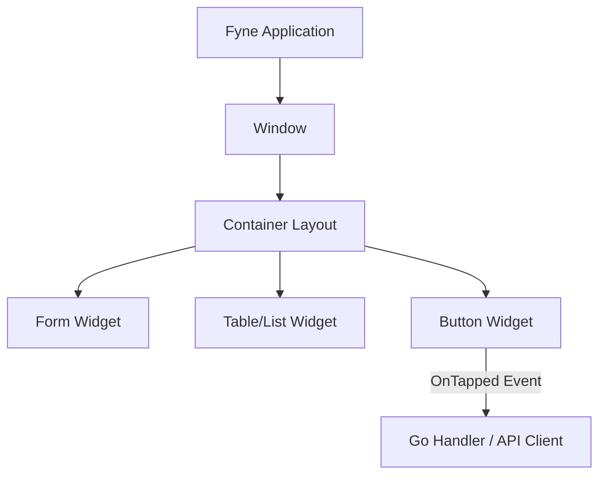
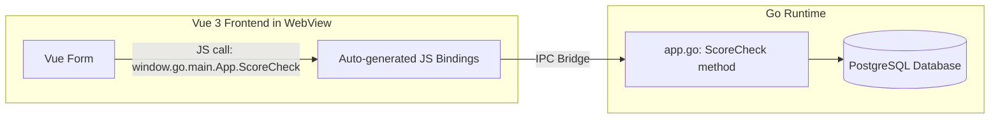

# Chapter 23: Go GUI Desktop Applications

## Purpose

As systems scale, web portals are not the only access points. Operations teams and administrative checkers often require dedicated desktop tools that work offline, interface with native peripherals (like smart-card readers for CNIC verification), and bypass browser sandbox restrictions. Go is highly suited for building cross-platform desktop GUIs. In this chapter, we explore the Go GUI ecosystem, compare native widget architectures to hybrid WebView wrappers, and build a desktop replication of the PEACE SME Grant Portal using both **Fyne** and **Wails**.

---

## The Go GUI Ecosystem

Go's GUI libraries are categorized by their rendering engine and architecture:

| Framework | Rendering Style | Architecture | Best For |
|---|---|---|---|
| **[Fyne](term:fyne)** | Canvas-based GPU (OpenGL/Mesa) | Retained-mode | Cross-platform native utilities |
| **[Wails](term:wails)** | Native OS HTML5 [WebView](term:webview) | Hybrid Web/Go bindings | Desktop apps reusing Vue 3/React |
| **Gio** | Canvas-based GPU (Vulkan/Metal/OpenGL) | [Immediate-mode](term:immediate-mode) | High-performance custom graphics |
| **Walk** | Win32 API wrapper | Retained-mode native | Windows-only enterprise integrations |
| **Lorca / Webview** | Chrome DevTools / WebView | Hybrid web view | Ultra-lightweight HTML wrappers |

---

## Part 1: Native Desktop GUIs with Fyne

**Fyne** uses [retained-mode](term:retained-mode) rendering. You build a tree of widget structs, and Fyne renders them directly onto a hardware-accelerated OpenGL canvas. It is fully cross-compilable to Windows, macOS, Linux, Android, and iOS.

### Concept Map of Fyne Architecture



### Implementing the PEACE SME Desktop App in Fyne

Below is a complete, compilable Go desktop application replicating the PEACE SME registration and grant-scoring panel. It makes HTTP calls to the backend, validates the inputs, and displays the fraud score.

Save this in `cmd/desktop-fyne/main.go`:

```go
package main

import (
    "bytes"
    "encoding/json"
    "fmt"
    "net/http"
    "time"

    "fyne.io/fyne/v2"
    "fyne.io/fyne/v2/app"
    "fyne.io/fyne/v2/container"
    "fyne.io/fyne/v2/dialog"
    "fyne.io/fyne/v2/widget"
)

type ScoreRequest struct {
    CNIC          string  `json:"cnic"`
    Amount        float64 `json:"amount"`
    District      string  `json:"district"`
    HasBusiness   bool    `json:"has_business"`
    HasDocuments  bool    `json:"has_documents"`
}

type ScoreResponse struct {
    RiskScore int    `json:"risk_score"`
    RiskLevel string `json:"risk_level"`
}

func main() {
    myApp := app.New()
    myWindow := myApp.NewWindow("PEACE SME Grant Checker")
    myWindow.Resize(fyne.NewSize(500, 400))

    // Form inputs
    cnicEntry := widget.NewEntry()
    cnicEntry.SetPlaceHolder("e.g. 17301-1234567-1")

    amountEntry := widget.NewEntry()
    amountEntry.SetPlaceHolder("e.g. 500000")

    districtSelect := widget.NewSelect([]string{"Swat", "Shangla", "Upper Dir", "Peshawar"}, func(value string) {})
    districtSelect.SetSelected("Swat")

    hasBusinessCheck := widget.NewCheck("Has Registered Business Profile", func(bool) {})
    hasDocumentsCheck := widget.NewCheck("Has Uploaded Mandatory Documents", func(bool) {})

    // Results output
    scoreLabel := widget.NewLabel("Risk Score: N/A")
    levelLabel := widget.NewLabel("Risk Status: Ready")

    form := &widget.Form{
        Items: []*widget.FormItem{
            {Text: "Applicant CNIC", Widget: cnicEntry},
            {Text: "Requested Amount (PKR)", Widget: amountEntry},
            {Text: "SME Location District", Widget: districtSelect},
            {Text: "Business Profile Status", Widget: hasBusinessCheck},
            {Text: "Document Upload Status", Widget: hasDocumentsCheck},
        },
        OnSubmit: func() {
            var amount float64
            _, err := fmt.Sscanf(amountEntry.Text, "%f", &amount)
            if err != nil {
                dialog.ShowError(fmt.Errorf("invalid amount format"), myWindow)
                return
            }

            reqBody := ScoreRequest{
                CNIC:         cnicEntry.Text,
                Amount:       amount,
                District:     districtSelect.Selected,
                HasBusiness:  hasBusinessCheck.Checked,
                HasDocuments: hasDocumentsCheck.Checked,
            }

            jsonData, _ := json.Marshal(reqBody)
            
            // Post payload to Go backend HFC Scoring API
            client := &http.Client{Timeout: 5 * time.Second}
            resp, err := client.Post("http://localhost:8080/api/admin/score-check", "application/json", bytes.NewBuffer(jsonData))
            if err != nil {
                dialog.ShowError(fmt.Errorf("backend server offline: %v", err), myWindow)
                return
            }
            defer resp.Body.Close()

            if resp.StatusCode != http.StatusOK {
                dialog.ShowError(fmt.Errorf("server returned status: %d", resp.StatusCode), myWindow)
                return
            }

            var scoreResp ScoreResponse
            json.NewDecoder(resp.Body).Decode(&scoreResp)

            scoreLabel.SetText(fmt.Sprintf("Risk Score: %d / 100", scoreResp.RiskScore))
            levelLabel.SetText(fmt.Sprintf("Risk Status: %s", scoreResp.RiskLevel))
        },
    }

    content := container.NewVBox(
        widget.NewLabelWithStyle("PEACE SME Desk Portal", fyne.TextAlignCenter, fyne.TextStyle{Bold: true}),
        form,
        widget.NewSeparator(),
        scoreLabel,
        levelLabel,
    )

    myWindow.SetContent(content)
    myWindow.ShowAndRun()
}
```

To run this desktop app, install Fyne dependencies:
```bash
go get fyne.io/fyne/v2
go run cmd/desktop-fyne/main.go
```

---

## Part 2: Hybrid Desktop Apps with Wails

If you already have a mature Vue 3 frontend (which the PEACE SME portal does), rewriting every layout, validation, chart, and list component in native Go GUI code can represent a massive duplication of effort.

**Wails** solves this by packaging your existing Vue 3 application into a native desktop bundle. Wails runs the HTML/JS frontend inside a native desktop [WebView](term:webview) window. The javascript runtime calls Go backend functions directly through generated bindings, completely avoiding the overhead of local HTTP servers or REST APIs.

### Wails IPC Architecture



### Building a Wails App for the Grant Portal

#### 1. Bootstrap a Wails Project
Run this command from your terminal to initialize a Wails desktop project using Vue 3 and Vite:

```bash
npx wails init -n peace-desktop -t vue
```

#### 2. Define Go Bindings in `app.go`
Wails maps public methods on your application struct directly into JavaScript. Define the database lookup and scoring operations in `app.go`:

```go
package main

import (
    "context"
    "fmt"
)

type App struct {
    ctx context.Context
}

type CheckResult struct {
    Allowed   bool   `json:"allowed"`
    RiskScore int    `json:"risk_score"`
    Reason    string `json:"reason"`
}

// CheckGrantEligibility is bound to javascript as window.go.main.App.CheckGrantEligibility
func (a *App) CheckGrantEligibility(cnic string, amount float64, district string) (CheckResult, error) {
    // Implement validation rules directly in Go
    score := 0
    reason := "Eligible"
    allowed := true

    if len(cnic) != 15 {
        return CheckResult{Allowed: false, RiskScore: 100, Reason: "Invalid CNIC format length"}, nil
    }

    // Swat/Shangla/Dir logic
    if district != "Swat" && district != "Shangla" && district != "Upper Dir" {
        score += 40
        reason = "Out-of-scope district"
        allowed = false
    }

    if amount > 1000000 {
        score += 30
        reason = "Requested amount exceeds checker limit"
    }

    return CheckResult{
        Allowed:   allowed,
        RiskScore: score,
        Reason:    reason,
    }, nil
}
```

#### 3. Bind the Vue Frontend
In your Vue components (e.g. `frontend/src/components/EligibilityChecker.vue`), import the generated Go bindings and invoke them as regular async JavaScript functions:

```vue
<template>
  <div class="desktop-panel">
    <h2>Verify Applicant eligibility</h2>
    <input v-model="cnic" placeholder="CNIC Format (xxxxx-xxxxxxx-x)" />
    <input v-model.number="amount" type="number" placeholder="Amount" />
    <button @click="verify">Run Verification Check</button>

    <div v-if="result" class="result-box">
      <p>Allowed: {{ result.allowed ? '✓ YES' : '✗ NO' }}</p>
      <p>Risk Score: {{ result.risk_score }}</p>
      <p>Analysis Result: {{ result.reason }}</p>
    </div>
  </div>
</template>

<script setup>
import { ref } from 'vue';
// Import auto-generated Go bindings
import { CheckGrantEligibility } from '../../wailsjs/go/main/App';

const cnic = ref('');
const amount = ref(0);
const result = ref(null);

async function verify() {
  try {
    // Direct call to Go function bypasses standard HTTP/REST latency
    result.value = await CheckGrantEligibility(cnic.value, amount.value, 'Swat');
  } catch (err) {
    console.error("IPC call failed:", err);
  }
}
</script>
```

#### 4. Run Wails in Development Mode
To build, watch, and run your app with hot reload on both frontend code and Go code:

```bash
wails dev
```

---

## Part 3: Packaging and Cross-Compilation

Desktop clients must be packaged into executable applications appropriate for the target operating system:

### Fyne Packaging
Use the Fyne CLI tool to package your Go binary with its app icons and metadata:

```bash
# Install Fyne compiler utility
go install fyne.io/fyne/v2/cmd/fyne@latest

# Package app for the current operating system
fyne package -os windows -icon myicon.png
```

### Wails Packaging
Wails compiles the frontend assets, compiles your Go code, embeds assets inside the binary, and produces a native executable:

```bash
# Package standard production release build
wails build
```

The resulting binary (`peace-desktop.exe` on Windows or `peace-desktop.app` on macOS) is fully self-contained and ready for distribution.

---

## Study Links for Desktop GUIs

1. **[Fyne Developer Guide](https://developer.fyne.io)**: Comprehensive widgets catalog, layouts reference, and deployment directions.
2. **[Wails Documentation](https://wails.io/docs/introduction)**: Setup instructions, bridge binding references, and frontend integrations guides.
3. **[Fyne Setup instructions on Windows](https://developer.fyne.io/started/)**: Setting up compilers and packages on Windows environments.
